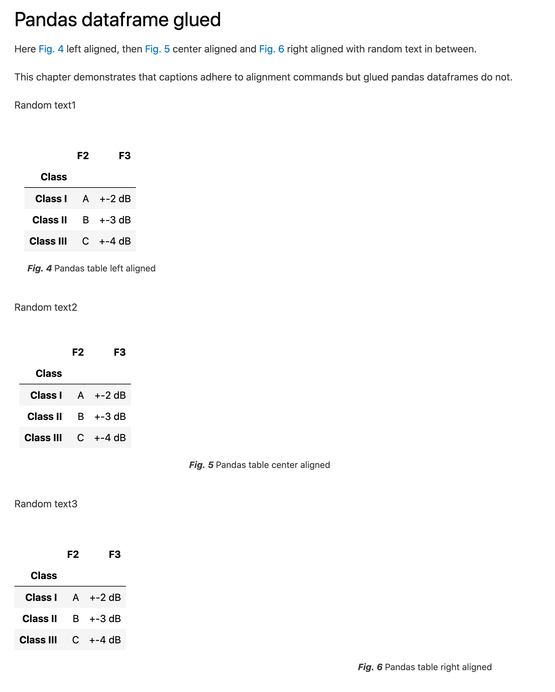
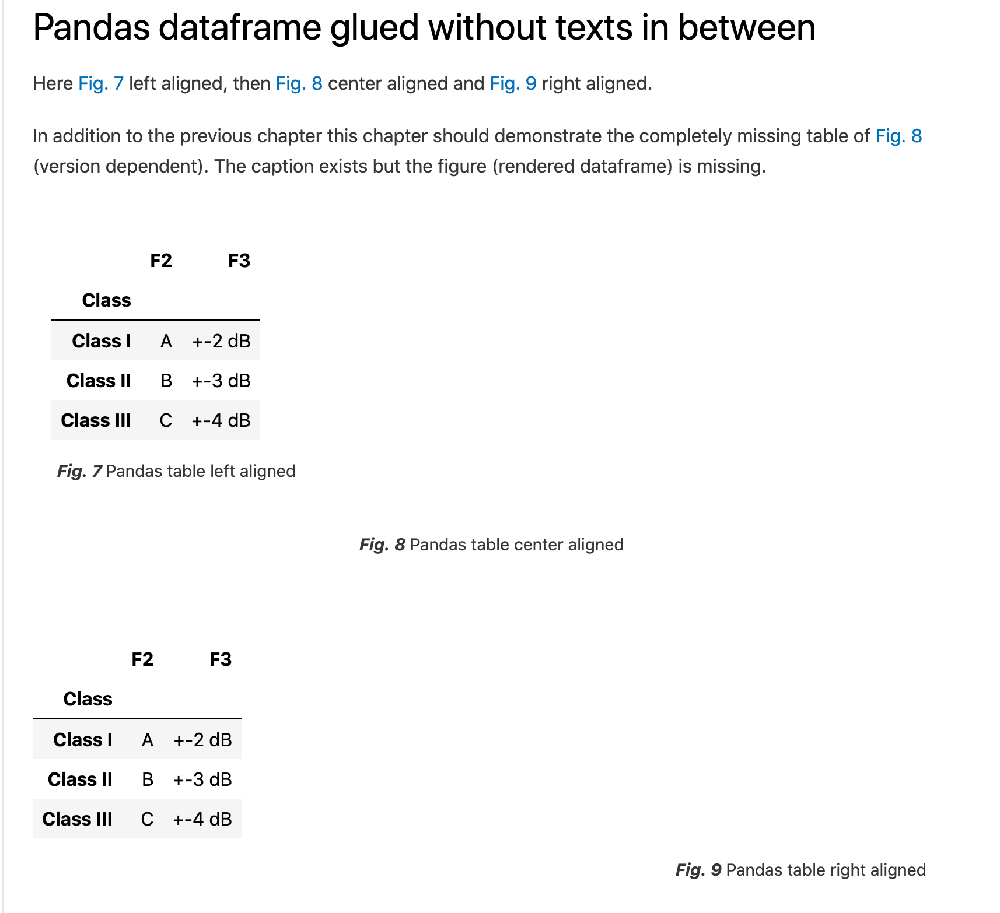

# Build Documentation
```bash
# Build all or
jupyter-book build --all .
```

# This repository demonstrates the glued pandas dataframe alignment issue.

This has been tested both on macOS Catalina:
```bash
% sw_vers               
ProductName:	Mac OS X
ProductVersion:	10.15.7
BuildVersion:	19H1417
(venv) % python --version
Python 3.9.9
(venv) % jupyter-book --version
Jupyter Book      : 0.12.1
External ToC      : 0.2.3
MyST-Parser       : 0.15.2
MyST-NB           : 0.13.1
Sphinx Book Theme : 0.1.8
Jupyter-Cache     : 0.4.3
NbClient          : 0.5.9
(venv)  % pip list | grep pandas 
pandas                        1.3.5
```
and Ubuntu 20.04:
```bash
% lsb_release -a
No LSB modules are available.
Distributor ID:	Ubuntu
Description:	Ubuntu 20.04.3 LTS
Release:	20.04
Codename:	focal
% python3 --version
Python 3.8.10
% jupyter-book --version
Jupyter Book      : 0.12.0
External ToC      : 0.2.3
MyST-Parser       : 0.15.2
MyST-NB           : 0.13.1
Sphinx Book Theme : 0.1.6
Jupyter-Cache     : 0.4.3
NbClient          : 0.5.4
% pip list | grep pandas
pandas                        1.3.4
```
## Demonstration that regular image inserts align properly

Screen capture of the rendered result below:


## Demonstration that glued pandas dataframes do not align

Screen capture of the rendered result below:



## Demonstration that in addition with certain OS - installed package combinations dataframes do not render at all.

This behavior reproduces ONLY on macOS:

Screen capture of the rendered result below:


